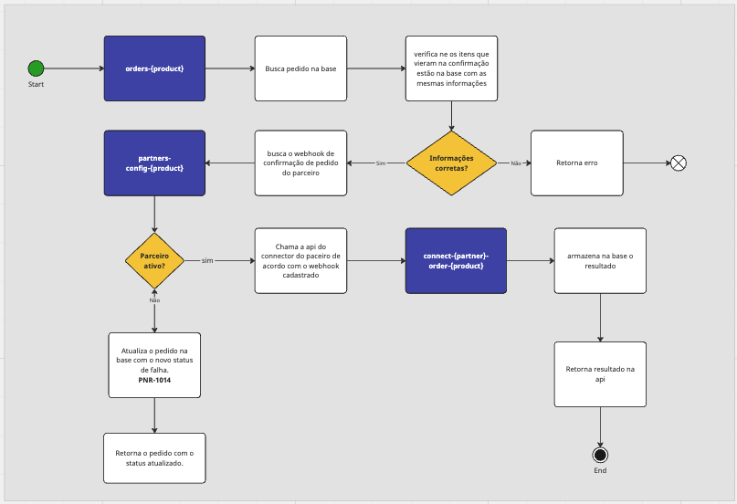

# Order Flight - Confirmation Order

API responsável por solicitar a confirmação do pedido pelo connector do parceiro.

## Endpoint

/order-flight/v1/orders/{id}/confirmation

## Contexto

Para que aconteça a confirmação da ordem o Order Flight ira solicitar a confirmação no parceiro por meio do connector. É também responsável por fazer toda tratativa de error a partir da solicitação até a atualização da ordem no oracle database.

## Regras:

- O `{id}` enviado na URL precisa ser um id válido, ou seja, precisa ter o prefixo `lf`;
- A Ordem devem estar salva na oracle database caso o contrário será lançado o erro `Status: 400 -> Order not found`;
- O Parceiro deve tá ativo para que confirmação seja bem sucedida ou então será lançado o erro `Status: 400 -> Partner disabled`;
- O body da requisição não pode ter divergências dos valores da ordem que está salva na base (commerceOrderId, pointsAmount, items.length) caso haja divergência será lançado o erro `Status: 400 -> Objects are not equal`;
- O current status da ordem deve ser `LIVPNR-1006` ou `resubmission=true` caso o contrário será lançado o erro `Status: 400 -> Order is already confirmed`;

### Diagrama:

## Mocks

Para os cenários de confirmação, temos alguns mocks configurados no projeto citado na aba "Mockando dependências". A seguir, iremos exemplificar quais cenários existem e como faz para cair em cada cenário.

### Solicitação de confirmação no parceiro -> Status: em processamento

**Descrição do cenário:** Esse é o cenário onde o parceiro retorna que o pedido está sendo processado e ainda não tem um resultado final sobre a confirmação. O status a ser retornado é o **LIVPNR-1007 - PROCESSING**

**Request:**
POST /order-flight/v1/orders/**lf200**/confirm
Payload: qualquer payload com a estrutura abaixo:

  
Clique para ver o payload

    <pre>
        {
            "resubmission": false,
            "items": [
                {
                    "id": "CVCFLIGHT",
                    "commerceItemId": "ci16238303923791",
                    "transferScheduler": false,
                    "productType": "type_flight",
                    "productId": "LIVFLIGHT",
                    "amount": "18200.0",
                    "rawTotalPrice": "1.0",
                    "mobileRecharge": {
                        "type": "RECHARGE",
                        "carrierDisplayName": "CVC"
                    },
                    "withClub": false,
                    "currency": "PTS",
                    "price": 18200,
                    "quantity": 1
                },
                {
                    "id": "CVCFLIGHTTAX",
                    "commerceItemId": "ci13406264327442",
                    "transferScheduler": false,
                    "productType": "type_flight_tax",
                    "productId": "LIVFLIGHTTAX",
                    "amount": "3500.0",
                    "rawTotalPrice": "1.0",
                    "mobileRecharge": {
                        "type": "RECHARGE",
                        "carrierDisplayName": "CVC"
                    },
                    "withClub": false,
                    "currency": "PTS",
                    "price": 3500,
                    "quantity": 1
                }
            ],
            "amount": {
                "currency": "PTS",
                "total": 21700,
                "rawSubtotal": 21700
            },
            "submittedDate": "2024-01-18T23:52:47Z",
            "channel": "I",
            "originOfOrder": "default",
            "promotionCodes": null,
            "orderId": "o12350358",
            "customer": {
                "profileId": "122518923",
                "id": "02444181018",
                "firstName": "Felipe",
                "lastName": "Lanzarin",
                "gender": "M",
                "birthDate": "1995-06-15",
                "email": "felipe.lanzarin@compasso.com.br",
                "phones": [
                    {
                        "type": "MOBILE",
                        "countryCode": "+55",
                        "areaCode": "54",
                        "number": "996327804"
                    }
                ]
            },
            "addresses": [
                {
                    "type": "BILL",
                    "address1": "Avenida Brasil Oeste",
                    "address2": "590",
                    "address3": "Não Informado",
                    "district": "Centro",
                    "city": "Passo Fundo",
                    "state": "RS",
                    "country": "BR",
                    "postalCode": "99025000"
                },
                {
                    "type": "SHIP",
                    "address1": "Avenida Brasil Oeste",
                    "address2": "590",
                    "address3": "Não Informado",
                    "district": "Centro",
                    "city": "Passo Fundo",
                    "state": "RS",
                    "country": "BR",
                    "postalCode": "99025000"
                }
            ],
            "shipmentOptionId": "12345",
            "payment": {
                "brand": "default",
                "paymentOptionId": "12345",
                "installmentOptionId": "12345"
            }
        }
    </pre>

  
Clique para ver o Response

    <pre>
        {
            "id": "o1000",
            "currency": "PTS",
            "amount": 150000,
            "items": [
                {
                "id": "cvc_flight",
                "partnerOrderId": "5010",
                "status": {
                    "code": "LIVPRN-1007",
                    "message": "PROCESSING",
                    "details": "Pedido confirmado em processamento"
                },
                "currency": "PTS",
                "quantity": 1,
                "price": 130000
                },
                {
                "id": "cvc_flight_tax",
                "partnerOrderId": "5010",
                "status": {
                    "code": "LIVPRN-1007",
                    "message": "PROCESSING",
                    "details": "Pedido confirmado em processamento"
                },
                "currency": "PTS",
                "quantity": 1,
                "price": 20000
                }
            ]
        }

</pre>

### Pedido confimado no parceiro

**Descrição do cenário:** Esse é o cenário onde o parceiro retorna que o pedido está confirmado. O status a ser retornado é o **LIVPNR-1019 - PROCESSING**

**Request:**
POST /v2/orders/**lf200**/confirm
Payload: qualquer payload com a estrutura abaixo:

  
Clique para ver o payload

    <pre>
        {
            "resubmission": false,
            "items": [
                {
                    "id": "CVCFLIGHT",
                    "commerceItemId": "ci16238303923791",
                    "transferScheduler": false,
                    "productType": "type_flight",
                    "productId": "LIVFLIGHT",
                    "amount": "18200.0",
                    "rawTotalPrice": "1.0",
                    "mobileRecharge": {
                        "type": "RECHARGE",
                        "carrierDisplayName": "CVC"
                    },
                    "withClub": false,
                    "currency": "PTS",
                    "price": 18200,
                    "quantity": 1
                },
                {
                    "id": "CVCFLIGHTTAX",
                    "commerceItemId": "ci13406264327442",
                    "transferScheduler": false,
                    "productType": "type_flight_tax",
                    "productId": "LIVFLIGHTTAX",
                    "amount": "3500.0",
                    "rawTotalPrice": "1.0",
                    "mobileRecharge": {
                        "type": "RECHARGE",
                        "carrierDisplayName": "CVC"
                    },
                    "withClub": false,
                    "currency": "PTS",
                    "price": 3500,
                    "quantity": 1
                }
            ],
            "amount": {
                "currency": "PTS",
                "total": 21700,
                "rawSubtotal": 21700
            },
            "submittedDate": "2024-01-18T23:52:47Z",
            "channel": "I",
            "originOfOrder": "default",
            "promotionCodes": null,
            "orderId": "o12350358",
            "customer": {
                "profileId": "122518923",
                "id": "02444181018",
                "firstName": "Felipe",
                "lastName": "Lanzarin",
                "gender": "M",
                "birthDate": "1995-06-15",
                "email": "felipe.lanzarin@compasso.com.br",
                "phones": [
                    {
                        "type": "MOBILE",
                        "countryCode": "+55",
                        "areaCode": "54",
                        "number": "996327804"
                    }
                ]
            },
            "addresses": [
                {
                    "type": "BILL",
                    "address1": "Avenida Brasil Oeste",
                    "address2": "590",
                    "address3": "Não Informado",
                    "district": "Centro",
                    "city": "Passo Fundo",
                    "state": "RS",
                    "country": "BR",
                    "postalCode": "99025000"
                },
                {
                    "type": "SHIP",
                    "address1": "Avenida Brasil Oeste",
                    "address2": "590",
                    "address3": "Não Informado",
                    "district": "Centro",
                    "city": "Passo Fundo",
                    "state": "RS",
                    "country": "BR",
                    "postalCode": "99025000"
                }
            ],
            "shipmentOptionId": "12345",
            "payment": {
                "brand": "default",
                "paymentOptionId": "12345",
                "installmentOptionId": "12345"
            }
        }
    </pre>

    
Clique para ver o Response

    <pre>
        {
            "id": "o10000",
            "currency": "PTS",
            "amount": 150000,
            "items": [
                {
                    "id": "cvc_flight",
                    "partnerOrderId": "5010",
                    "status": {
                        "code": "LIVPRN-1019",
                        "message": "PROCESSING",
                        "details": "Pedido confirmado com sucesso"
                    },
                    "currency": "PTS",
                    "quantity": 1,
                    "price": 130000
                },
                {
                    "id": "cvc_flight_tax",
                    "partnerOrderId": "5010",
                    "status": {
                        "code": "LIVPRN-1019",
                        "message": "PROCESSING",
                        "details": "Pedido confirmado com sucesso"
                    },
                    "currency": "PTS",
                    "quantity": 1,
                    "price": 20000
                }
            ]
        }
    </pre>

### Pedido com falha

**Descrição do cenário:** Esse é o cenário onde o parceiro retorna que o ocorreu alguma falha no pedido e que necessita de uma ação manual. O status a ser retornado é o **LIVPNR-1014 - FAILED**

**Request:**
POST /v2/orders/**lf400**/confirm
Payload: qualquer payload com a estrutura abaixo:

  
Clique para ver o payload

    <pre>
        {
            "resubmission": false,
            "items": [
                {
                    "id": "CVCFLIGHT",
                    "commerceItemId": "ci16238303923791",
                    "transferScheduler": false,
                    "productType": "type_flight",
                    "productId": "LIVFLIGHT",
                    "amount": "18200.0",
                    "rawTotalPrice": "1.0",
                    "mobileRecharge": {
                        "type": "RECHARGE",
                        "carrierDisplayName": "CVC"
                    },
                    "withClub": false,
                    "currency": "PTS",
                    "price": 18200,
                    "quantity": 1
                },
                {
                    "id": "CVCFLIGHTTAX",
                    "commerceItemId": "ci13406264327442",
                    "transferScheduler": false,
                    "productType": "type_flight_tax",
                    "productId": "LIVFLIGHTTAX",
                    "amount": "3500.0",
                    "rawTotalPrice": "1.0",
                    "mobileRecharge": {
                        "type": "RECHARGE",
                        "carrierDisplayName": "CVC"
                    },
                    "withClub": false,
                    "currency": "PTS",
                    "price": 3500,
                    "quantity": 1
                }
            ],
            "amount": {
                "currency": "PTS",
                "total": 21700,
                "rawSubtotal": 21700
            },
            "submittedDate": "2024-01-18T23:52:47Z",
            "channel": "I",
            "originOfOrder": "default",
            "promotionCodes": null,
            "orderId": "o12350358",
            "customer": {
                "profileId": "122518923",
                "id": "02444181018",
                "firstName": "Felipe",
                "lastName": "Lanzarin",
                "gender": "M",
                "birthDate": "1995-06-15",
                "email": "felipe.lanzarin@compasso.com.br",
                "phones": [
                    {
                        "type": "MOBILE",
                        "countryCode": "+55",
                        "areaCode": "54",
                        "number": "996327804"
                    }
                ]
            },
            "addresses": [
                {
                    "type": "BILL",
                    "address1": "Avenida Brasil Oeste",
                    "address2": "590",
                    "address3": "Não Informado",
                    "district": "Centro",
                    "city": "Passo Fundo",
                    "state": "RS",
                    "country": "BR",
                    "postalCode": "99025000"
                },
                {
                    "type": "SHIP",
                    "address1": "Avenida Brasil Oeste",
                    "address2": "590",
                    "address3": "Não Informado",
                    "district": "Centro",
                    "city": "Passo Fundo",
                    "state": "RS",
                    "country": "BR",
                    "postalCode": "99025000"
                }
            ],
            "shipmentOptionId": "12345",
            "payment": {
                "brand": "default",
                "paymentOptionId": "12345",
                "installmentOptionId": "12345"
            }
        }
    </pre>

    
Clique para ver o Response

    <pre>
        {
            "id": "o1000",
            "currency": "PTS",
            "amount": 150000,
            "items": [
                {
                    "id": "cvc_flight",
                    "partnerOrderId": "5010",
                    "status": {
                        "code": "LIVPRN-1014",
                        "message": "FAILED",
                        "details": "Os dados fornecidos na solicitação são inválidos ou incompletos."
                    },
                    "currency": "PTS",
                    "quantity": 1,
                    "price": 130000
                },
                {
                    "id": "cvc_flight_tax",
                    "partnerOrderId": "5010",
                    "status": {
                        "code": "LIVPRN-1014",
                        "message": "FAILED",
                        "details": "Os dados fornecidos na solicitação são inválidos ou incompletos."
                    },
                    "currency": "PTS",
                    "quantity": 1,
                    "price": 20000
                }
            ]
        }
    </pre>

### Pedido cancelado

**Descrição do cenário:** Esse é o cenário onde o parceiro retorna que o pedido não pode ser processado e ele deve ser cancelado automaticamente. O status a ser retornado é o **LIVPNR-9001 - CANCELLED**

**Request:**
POST /v2/orders/**lf400c**/confirm
Payload: qualquer payload com a estrutura abaixo:

  
Clique para ver o payload

    <pre>
        {
            "resubmission": false,
            "items": [
                {
                    "id": "CVCFLIGHT",
                    "commerceItemId": "ci16238303923791",
                    "transferScheduler": false,
                    "productType": "type_flight",
                    "productId": "LIVFLIGHT",
                    "amount": "18200.0",
                    "rawTotalPrice": "1.0",
                    "mobileRecharge": {
                        "type": "RECHARGE",
                        "carrierDisplayName": "CVC"
                    },
                    "withClub": false,
                    "currency": "PTS",
                    "price": 18200,
                    "quantity": 1
                },
                {
                    "id": "CVCFLIGHTTAX",
                    "commerceItemId": "ci13406264327442",
                    "transferScheduler": false,
                    "productType": "type_flight_tax",
                    "productId": "LIVFLIGHTTAX",
                    "amount": "3500.0",
                    "rawTotalPrice": "1.0",
                    "mobileRecharge": {
                        "type": "RECHARGE",
                        "carrierDisplayName": "CVC"
                    },
                    "withClub": false,
                    "currency": "PTS",
                    "price": 3500,
                    "quantity": 1
                }
            ],
            "amount": {
                "currency": "PTS",
                "total": 21700,
                "rawSubtotal": 21700
            },
            "submittedDate": "2024-01-18T23:52:47Z",
            "channel": "I",
            "originOfOrder": "default",
            "promotionCodes": null,
            "orderId": "o12350358",
            "customer": {
                "profileId": "122518923",
                "id": "02444181018",
                "firstName": "Felipe",
                "lastName": "Lanzarin",
                "gender": "M",
                "birthDate": "1995-06-15",
                "email": "felipe.lanzarin@compasso.com.br",
                "phones": [
                    {
                        "type": "MOBILE",
                        "countryCode": "+55",
                        "areaCode": "54",
                        "number": "996327804"
                    }
                ]
            },
            "addresses": [
                {
                    "type": "BILL",
                    "address1": "Avenida Brasil Oeste",
                    "address2": "590",
                    "address3": "Não Informado",
                    "district": "Centro",
                    "city": "Passo Fundo",
                    "state": "RS",
                    "country": "BR",
                    "postalCode": "99025000"
                },
                {
                    "type": "SHIP",
                    "address1": "Avenida Brasil Oeste",
                    "address2": "590",
                    "address3": "Não Informado",
                    "district": "Centro",
                    "city": "Passo Fundo",
                    "state": "RS",
                    "country": "BR",
                    "postalCode": "99025000"
                }
            ],
            "shipmentOptionId": "12345",
            "payment": {
                "brand": "default",
                "paymentOptionId": "12345",
                "installmentOptionId": "12345"
            }
        }
    </pre>

    
Clique para ver o Response

    <pre>
        {
            "id": "o1000",
            "currency": "PTS",
            "amount": 150000,
            "items": [
                {
                    "id": "cvc_flight",
                    "partnerOrderId": "5010",
                    "status": {
                        "code": "LIVPRN-9001",
                        "message": "CANCELED",
                        "details": "Os dados fornecidos na solicitação são inválidos ou incompletos."
                    },
                    "currency": "PTS",
                    "quantity": 1,
                    "price": 130000
                },
                {
                    "id": "cvc_flight_tax",
                    "partnerOrderId": "5010",
                    "status": {
                        "code": "LIVPRN-9001",
                        "message": "CANCELED",
                        "details": "Os dados fornecidos na solicitação são inválidos ou incompletos."
                    },
                    "currency": "PTS",
                    "quantity": 1,
                    "price": 20000
                }
            ]
        }
    </pre>

### Erro desconhecido

**Descrição do cenário:** Esse é o cenário onde o order-flight ocasionou algum erro que não pode ser tratado. O status da request será um erro 500.

**Request:**
POST /v2/orders/**lf500**/confirm
Payload: qualquer payload com a estrutura abaixo:

  
Clique para ver o payload

    <pre>
        {
            "resubmission": false,
            "items": [
                {
                    "id": "CVCFLIGHT",
                    "commerceItemId": "ci16238303923791",
                    "transferScheduler": false,
                    "productType": "type_flight",
                    "productId": "LIVFLIGHT",
                    "amount": "18200.0",
                    "rawTotalPrice": "1.0",
                    "mobileRecharge": {
                        "type": "RECHARGE",
                        "carrierDisplayName": "CVC"
                    },
                    "withClub": false,
                    "currency": "PTS",
                    "price": 18200,
                    "quantity": 1
                },
                {
                    "id": "CVCFLIGHTTAX",
                    "commerceItemId": "ci13406264327442",
                    "transferScheduler": false,
                    "productType": "type_flight_tax",
                    "productId": "LIVFLIGHTTAX",
                    "amount": "3500.0",
                    "rawTotalPrice": "1.0",
                    "mobileRecharge": {
                        "type": "RECHARGE",
                        "carrierDisplayName": "CVC"
                    },
                    "withClub": false,
                    "currency": "PTS",
                    "price": 3500,
                    "quantity": 1
                }
            ],
            "amount": {
                "currency": "PTS",
                "total": 21700,
                "rawSubtotal": 21700
            },
            "submittedDate": "2024-01-18T23:52:47Z",
            "channel": "I",
            "originOfOrder": "default",
            "promotionCodes": null,
            "orderId": "o12350358",
            "customer": {
                "profileId": "122518923",
                "id": "02444181018",
                "firstName": "Felipe",
                "lastName": "Lanzarin",
                "gender": "M",
                "birthDate": "1995-06-15",
                "email": "felipe.lanzarin@compasso.com.br",
                "phones": [
                    {
                        "type": "MOBILE",
                        "countryCode": "+55",
                        "areaCode": "54",
                        "number": "996327804"
                    }
                ]
            },
            "addresses": [
                {
                    "type": "BILL",
                    "address1": "Avenida Brasil Oeste",
                    "address2": "590",
                    "address3": "Não Informado",
                    "district": "Centro",
                    "city": "Passo Fundo",
                    "state": "RS",
                    "country": "BR",
                    "postalCode": "99025000"
                },
                {
                    "type": "SHIP",
                    "address1": "Avenida Brasil Oeste",
                    "address2": "590",
                    "address3": "Não Informado",
                    "district": "Centro",
                    "city": "Passo Fundo",
                    "state": "RS",
                    "country": "BR",
                    "postalCode": "99025000"
                }
            ],
            "shipmentOptionId": "12345",
            "payment": {
                "brand": "default",
                "paymentOptionId": "12345",
                "installmentOptionId": "12345"
            }
        }
    </pre>

    
Clique para ver o Response

    <pre>
        {
            "code": "INTERNAL_SERVER_ERROR",
            "message": "Internal Server Error",
            "details": [
                "Internal Server Error"
            ]
        }
    </pre>

