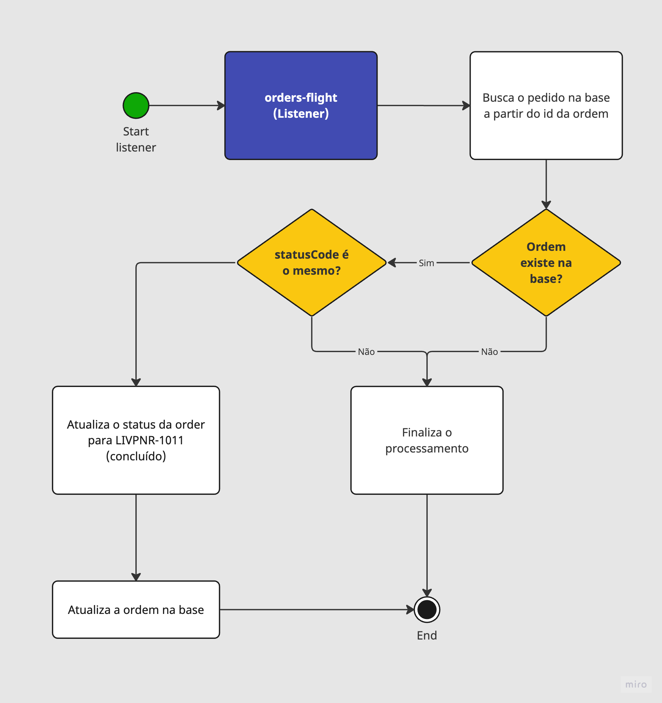

# Order Flight - Process Order

Listener responsável pelo processo de consulta de pedidos que estão prontos para serem finalizados.

## Queue

`Queue:` order-flight.flight.commands.order.getcompleted

	
Clique para ver o retorno da fila

	<pre>
		{
			"id": "lf1213",
			"commerceOrderId": "o12313"
		}
   </pre>

> Observação: Apenas pedidos com `statusCode=LIVPNR-1030` e com última data de chegada menor que o dia atual vão ser inseridos nessa queue

## Contexto

Este listener permanecerá atento à fila em busca de pedidos disponíveis para processamento. Ao consumir um pedido, será iniciado o fluxo de processamento e a ordem tentará ser processada, podendo falhar durante o processo. 

## Fluxo

O fluxo de processamento inicia no MS [order-flight-scheduler](https://stash.livelo.intranet/projects/LIVTRAVEL/repos/order-flight-scheduler/browse), onde ele busca e adiciona à fila uma quantidade específica de pedidos para processamento. Em seguida, o MS order-flight consome os pedidos da fila de forma individual, realizando diversas validações.  Por fim, o sistema registra a atualização do pedido na base de dados.

## Regras:

Para iniciar o processamento, é fundamental que as seguintes condições sejam atendidas:

- A ordem deve existir na base de dados.
- O status da ordem precisa ser `LIVPNR-1030`.

## Diagrama

