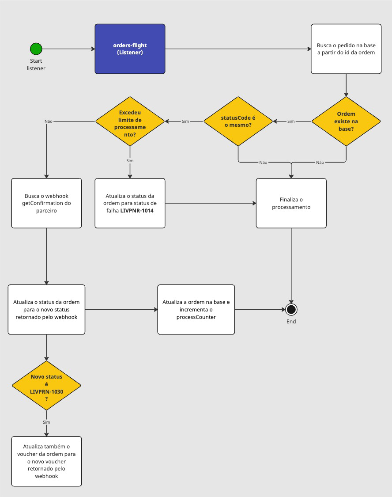

# Order Flight - Process Order

Listener responsável pelo processo de consulta de pedidos que estão aguardando o voucher.

## Queue

`Queue:` order-flight.flight.commands.order.getvoucher

	
Clique para ver o retorno da fila

	<pre>
		{
			"id": "lf1213",
			"commerceOrderId": "o12313"
		}
   </pre>

> Observação: Apenas pedidos com `statusCode=LIVPNR-1019` vão ser inseridos
> nessa Queue

## Contexto

Este listener permanecerá atento à fila em busca de pedidos disponíveis para processamento. Ao consumir um pedido, será iniciado o fluxo de processamento e a ordem tentará ser processada, podendo falhar durante o processo. No fim do processamento, o contador na tabela `processCounter.counter` será incrementado em +1.

Se o contador `processCounter.counter` atingir ou exceder `(order.getVoucherMaxProcessCountFailed)` tentativas, o status de falha `LIVPNR-1014` será registrado.

## Fluxo

O fluxo de processamento se da inicio no MS [order-flight-scheduler](https://stash.livelo.intranet/projects/LIVTRAVEL/repos/order-flight-scheduler/browse), onde ele busca e adiciona à fila uma quantidade específica de pedidos para processamento. Em seguida, o MS order-flight consome os pedidos da fila de forma individual, realizando diversas validações. Após essas validações, o sistema acessa o webhook getVoucher do parceiro para verificar se o voucher está disponível. Caso retorne o voucher, o status será atualizado para LIVPNR-1030 e o link disponibilizado. Por fim, o sistema registra a atualização do pedido na base de dados e incrementa o contador de processamento.

## Regras:

Para iniciar o processamento, é fundamental que as seguintes condições sejam atendidas:

- A ordem deve existir na base de dados.
- O status da ordem precisa ser `LIVPNR-1019`.
- O contador de tentativas de processamento da ordem deve ser inferior a `(order.getVoucherMaxProcessCountFailed)`.

> Observação: Variável `order.getVoucherMaxProcessCountFailed` do `application.yml`, tem o valor default de 192.

## Diagrama

